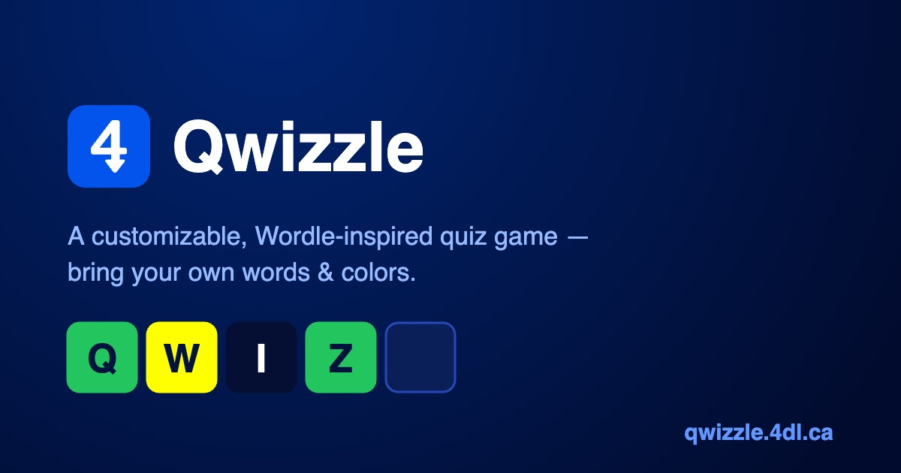

# Qwizzle

**A customizable, Wordle-inspired quiz game.** Guess the word from its clue —
then make the game your own: bring your own word lists, restyle every color,
and share your edition with friends.

**Play it at [qwizzle.4dl.ca](https://qwizzle.4dl.ca)** · part of the 4dl (4↓) family.



## Features

### The game
- **Daily & random modes** with Wordle-style feedback and correct
  duplicate-letter handling. The daily is deterministic *per word list*:
  everyone playing the same list gets the same word each UTC day, while
  different lists get independent dailies.
- **Stats that stick** — played, wins, current/best streak, and a score
  (100 points for a first-try solve down to 10 on the sixth; hints cost 20).
  Replaying a daily never double-counts.
- **Hard mode** — every revealed hint must be reused: greens stay in place,
  yellows must reappear. Toggle the `Hard` chip next to the mode switcher.
- **Share & challenge** — emoji-grid result card with one-tap share/copy,
  plus a *challenge a friend* link to the exact puzzle you just played
  (`?p=<n>`), and a "learn more" link on every solved word.
- Win confetti, first-letter hints, on-screen + physical keyboard with
  per-key coloring, `aria-live` status messaging, reduced-motion support,
  and light/dark themes.

### Bring your own words
Import a word list from any of:
- **JSON or CSV file** — `word,definition,expansion` columns (header
  optional, any order); JSON accepts `[{word, definition?, expansion?,
  clue?}]`, `{words:[…]}`, or `{data:[…]}`.
- **Pasted text** — `WORD=Definition` or `WORD,Definition` per line, plain
  words, or pasted JSON/CSV — the format is auto-detected.
- **URL / API** — any hosted JSON/CSV, with an optional auth header. A
  published Google Sheet CSV link works out of the box.
- **GitHub Gist** — paste the gist page or raw link; the first JSON/CSV
  file is used.

Words are normalized on import (uppercased, validated, deduped, size-bounded)
with clear row-count feedback and per-row skip warnings. The built-in default
is the [Cyberdle](https://github.com/adilio/cyberdle) security-acronym list
(164 words), bundled so anonymous/offline play always works.

### The Studio
One panel to restyle everything and save it as an **edition**
(`Qwizzle: Cyber Edition` — the Qwizzle brand and 4↓ logo are fixed; editions
customize the name, colors, and word list):

- **20 design tokens** across dark *and* light variants, edited with color
  pickers or hex fields against a live preview of every themed element
  (tiles in all states, keyboard, buttons, panels, messages).
- **Colors from a brand** — extract a palette from a website's favicon or an
  uploaded screenshot (client-side median-cut quantization, no API), or ask
  **AI** for a brand-inspired palette (signed-in users; the LLM key lives
  server-side in a Supabase Edge Function). Tap any extracted swatch to
  rebuild the theme around it, then fine-tune.
- **Contrast guard** — WCAG checks run live on the pairs that keep the board
  playable, with a one-click *nudge to legible* fix. An unreadable theme
  can't sneak through.
- **Portable editions** — export/import as a JSON file with no account
  needed; uploaded/pasted word lists are embedded so the file is
  self-contained.

### Accounts & sharing (optional)
Signed out, everything above works locally. Sign in with Google (via
Supabase) to:
- sync editions, word lists, and stats across devices,
- publish an edition as a **read-only share link** (`/e/<slug>`) that anyone
  can play without an account — theme, name, and word list included.

Row-level security guards every table; the client is never trusted for
ownership.

## Stack & architecture

Vite + React + TypeScript. The game engine is pure TypeScript with zero
framework dependencies, locked by a 107-test Vitest suite (`pnpm verify` =
typecheck + lint + tests, and gates every commit). Supabase provides Google
auth, Postgres with RLS, and one Edge Function (the AI palette — rate-limited,
auth-required, cost-bounded). Hosting is Netlify (auto-deploy from `main`),
DNS via Cloudflare. Dependencies are deliberately minimal: React, the
Supabase client, and dev tooling — color quantization, CSV parsing, contrast
math, and confetti are all hand-rolled. The app ships at ~155 KB gzipped.

```
src/brand.ts       the one Qwizzle brand token (never overridable)
src/engine/        pure game logic: feedback, daily seed, hard mode,
                   stats, share text — fully unit-tested
src/game/          board, keyboard, dialogs, session persistence
src/providers/     word-list sources: builtin, file, paste, URL/API, gist
src/wordlists/     list management + import UI
src/theme/         design tokens, contrast guard, quantizer, derivation
src/studio/        the customization Studio
src/editions/      edition model + portable JSON export/import
src/account/       account dialog (sign-in, saved editions, share links)
src/supabase/      config-gated client, auth, sync
src/data/          bundled Cyberdle acronym dataset
supabase/          SQL migrations (schema + RLS) and the palette function
```

## Develop

```sh
pnpm install
pnpm dev          # local game, no backend needed
pnpm verify       # typecheck + lint + tests — gate every commit on this
pnpm build
```

### Backend configuration

Accounts are entirely optional — with no env vars the app is a fully local
game and hides every account feature.

To enable them, copy `.env.example` to `.env` and set `VITE_SUPABASE_URL` +
`VITE_SUPABASE_ANON_KEY`. The same two variables must be set in the Netlify
build environment for the deployed site. Supabase setup:

1. Apply the SQL in `supabase/migrations/` (tables + RLS policies).
2. Enable the **Google** auth provider (client ID + secret) and make sure the
   site URL / redirect allowlist cover your domain.
3. Deploy the palette function (`supabase functions deploy palette`) and set
   its secret: `supabase secrets set LLM_API_KEY=<anthropic key>`. Without
   the key the function answers a clean 503 and the client hides the button.

The LLM key stays in the Edge Function environment — never in the client
build or Netlify.

## Want a single-file version?

Qwizzle is a built web app. If you want a zero-build, single-HTML-file game
you can copy anywhere, use its predecessor
**[Cyberdle](https://github.com/adilio/cyberdle)** — one `index.html`, no
tooling, same core gameplay.

## License

MIT © [Adil Leghari](https://github.com/adilio)
